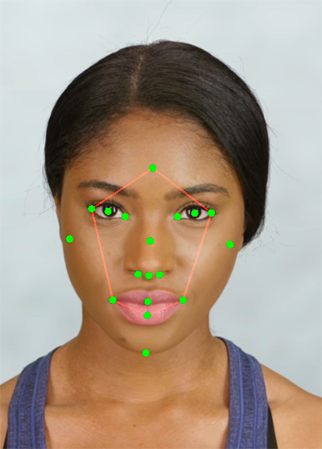

# Face-Points-To-Screen-Spark-Ar-Script
A Spark Ar script that transform face points into screen coordinates

I splited the scripts into multiple files, feel free to merge them.

Don't forget to add From Script variables.

Developed Version: **Spark AR Studio v118**

## Screenshots

## Author
José Luís Haas

Follow me on Instagram [@zeco.lab](https://instagram.com/zeco.lab)

## License

